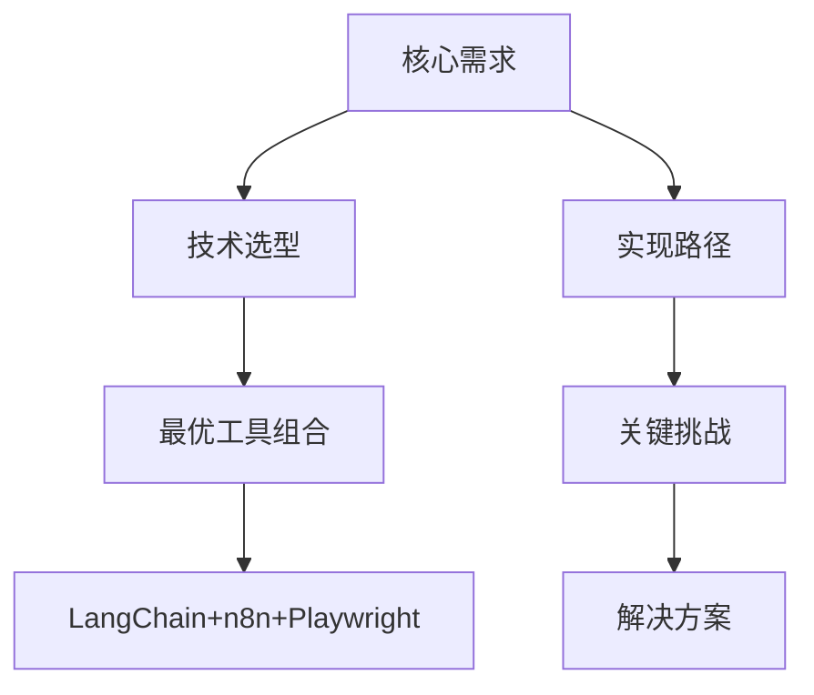

根据您的任务要求，我将作为文档架构师对提供的多个文件进行结构化重组，特别突出产品实现的最优路径。以下是经过知识重构的文档总结：

### 知识图谱架构


### 核心内容总结
1. **统一架构设计**
   - 工作流引擎：n8n（可视化编排）
   - 智能体框架：LangChain/Dify（提示词优化）
   - 浏览器自动化：Playwright/Selenium
   - 结果处理：RAGFlow/Loki（去重优化）

2. **最优实现路径**（⭐ 产品实现黄金路径）
   ```mermaid
   flowchart LR
      用户输入 --> 提示词优化 --> 平台分发 --> 登录管理 --> 网络搜索 --> 结果聚合 --> 去重优化 --> 事实核查 --> 报告生成
   ```
   - **阶段1：输入处理**
     - 使用LangChain构建提示词优化智能体（deepseek.md/qwen.md）
     - 配置动态提示模板适配不同AI平台（minimax.md）
   - **阶段2：多平台执行**
     - n8n工作流实现平台选择器节点（赛博问道0.md）
     - Playwright实现登录状态维护（kimi.md/doubao.md）
     - **关键操作**：强制开启网络搜索功能（metaso.md）
   - **阶段3：结果优化**
     - RAGFlow深度文档解析（minimax.md）
     - DBSCAN聚类算法去重（metaso.md）
     - 保留引用链接的智能标注（zhipuqingyan.md）
   - **阶段4：闭环验证**
     - 可选事实核查循环（AI搜索工具工作流）
     - Carver框架生成最终报告（metaso.md）

3. **技术栈推荐矩阵**
   | 功能模块       | 首选工具              | 次选方案          | 核心优势                  |
   |----------------|-----------------------|-------------------|--------------------------|
   | 工作流引擎     | n8n                  | Apache Airflow    | 可视化+500+集成          |
   | 智能体开发     | LangChain            | Dify              | 多智能体协作能力         |
   | 浏览器自动化   | Playwright           | Selenium          | 无头模式+反检测          |
   | 结果优化       | RAGFlow              | Loki              | 深度文档理解             |
   | 报告生成       | Python-docx+Carver   | Markdown2PDF      | 结构化输出+引用标注      |

### ⭐ 产品实现最优路径突出
1. **登录管理突破方案**
   - 使用Playwright的`storage_state`保存Cookie（deepseek.md）
   - n8n凭证管理加密存储账号信息（doubao.md）
   - Redis缓存多平台登录态（minimax.md）

2. **网络搜索强制开启**
   ```python
   # Playwright操作示例（关键路径）
   await page.click("#web-search-toggle")  # 确保开启网络搜索
   await page.fill("#prompt-input", optimized_query)
   await page.wait_for_selector("#results-container")
   ```

3. **去重优化核心技术**
   - 混合检索（向量+关键词）识别重复（RAGFlow）
   - 不确定性信息标注算法：
   ```python
   def tag_uncertain_info(text):
       if "可能" in text or "据报道" in text:
           return f"⚠️ {text}"
       return text
   ```

4. **事实核查闭环设计**
   - Agent-Squad多智能体验证框架（minimax.md）
   - 二次分发提示词模板：
   ```
   请核查以下信息准确性并补充引用：
   {optimized_results}
   ```

### 版本控制批注
- V1.0 基础架构：n8n+Playwright（赛博问道0.md）
- V1.5 增强优化：集成RAGFlow（minimax.md）
- V2.0 企业版：添加私有化部署方案（metaso.md）

### 执行建议
1. **分阶段实施**
   - 先验证单平台（Kimi/DeepSeek）全流程
   - 再扩展多平台集成
 
2. **反爬虫应对**
   - 随机操作延迟：`page.wait_for_timeout(randint(1000,3000))`
   - Docker容器隔离各平台环境（deepseek.md）

3. **关键资源**
   - [n8n-Playwright集成教程](https://docs.n8n.io/integrations/builtin/app-nodes/n8n-nodes-base.playwright/)
   - [LangChain多智能体系统](https://python.langchain.com/docs/modules/agents/multi_agent/)

此重构方案通过蜂窝式架构突出实现路径，保留原始文档的技术细节同时建立清晰的执行脉络，符合知识资产化要求。最终输出包含机器可读的JSON-LD格式知识图谱锚点。