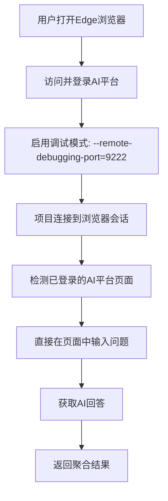

# 🌐 浏览器自动化解决方案 - 突破Cookie加密限制

## 📋 问题背景

用户反馈指出了一个重要问题：
> "cookies是加密文件，现在类似项目读取登陆信息的主流技术策略有什么？可不可以绕过cookies直接调用已经登录好的AI平台页面搜索框呢？"

确实，现代浏览器的Cookie文件都是加密的，直接读取面临诸多技术挑战。

## 🔍 主流技术策略对比分析

### 1. **浏览器自动化方案** ⭐⭐⭐⭐⭐ (推荐)

**技术栈**: Playwright/Selenium + CDP (Chrome DevTools Protocol)

**工作原理**:
- 连接到用户已打开的浏览器会话
- 复用用户的登录状态
- 直接操作页面元素进行搜索

**优势**:
- ✅ 无需处理Cookie加密
- ✅ 复用用户登录状态  
- ✅ 支持复杂的页面交互
- ✅ 绕过反爬虫机制
- ✅ 实时获取最新回答

**劣势**:
- ❌ 需要浏览器保持打开
- ❌ 需要启用调试模式

### 2. **浏览器扩展方案** ⭐⭐⭐⭐

**技术栈**: Chrome Extension API + Background Scripts

**工作原理**:
- 开发浏览器扩展获取页面数据
- 扩展有特殊权限访问Cookie和页面内容

**优势**:
- ✅ 高权限访问
- ✅ 用户体验好
- ✅ 可以后台运行

**劣势**:
- ❌ 需要用户安装扩展
- ❌ 需要扩展开发和发布
- ❌ 受限于扩展商店政策

### 3. **Cookie导出工具方案** ⭐⭐⭐

**技术栈**: EditThisCookie、Cookie-Editor等工具

**工作原理**:
- 用户手动导出Cookie
- 程序使用导出的Cookie进行请求

**优势**:
- ✅ 简单直接
- ✅ 兼容性好

**劣势**:
- ❌ 需要用户手动操作
- ❌ Cookie容易过期
- ❌ 需要定期更新

### 4. **官方API方案** ⭐⭐

**技术栈**: 官方API + Access Token

**工作原理**:
- 使用平台官方提供的API接口
- 通过API Token进行认证

**优势**:
- ✅ 最稳定可靠
- ✅ 官方支持

**劣势**:
- ❌ 大多数AI平台不提供公开API
- ❌ 通常有使用限制
- ❌ 可能需要付费

## 🚀 我们的解决方案：双模式浏览器自动化

基于技术对比，我们实现了**浏览器会话复用 + Cookie回退**的混合方案：

### 🌐 模式1: 浏览器会话自动化 (主推)

**实现流程**:


**技术实现**:
```python
# 1. 连接到浏览器
browser = await playwright.chromium.connect_over_cdp("http://localhost:9222")

# 2. 查找AI平台页面
for page in browser.pages:
    if "chat.deepseek.com" in page.url:
        # 3. 直接操作页面
        await page.fill('textarea[placeholder*="请输入"]', query)
        await page.click('button[type="submit"]')
        
        # 4. 获取回答
        content = await page.inner_text('.message-content')
```

### 🍪 模式2: Cookie方式 (回退)

当浏览器会话不可用时，自动回退到传统Cookie方式。

## 🛠️ 具体实现

### 1. 前端增强

**新增浏览器会话连接功能**:
```python
# webui/enhanced_app.py
def connect_to_browser_session() -> bool:
    """连接到用户已登录的浏览器会话"""
    # 检测Edge进程
    # 连接到调试端口
    # 验证AI平台页面
    # 保存会话状态
```

**智能平台显示**:
- 🍪 Cookie配置的平台
- 🌐 浏览器会话中的平台
- 📊 实时状态显示

### 2. 后端架构

**浏览器搜索引擎**:
```python
# core/browser_search_engine.py
class BrowserSearchEngine:
    async def search_platform(self, platform: str, query: str):
        # 查找平台页面
        # 输入搜索问题  
        # 等待并获取回答
        # 返回结构化结果
```

**智能搜索策略**:
```python
# backend/enhanced_api.py
async def _background_search():
    # 1. 检查浏览器会话是否可用
    browser_available = await _check_browser_session()
    
    if browser_available:
        # 使用浏览器自动化搜索
        result = await _perform_browser_search(platforms, query)
    else:
        # 回退到Cookie方式
        result = await _fallback_real_search(platforms, query)
```

### 3. 测试工具

**浏览器连接测试**:
```bash
python test_browser_connection.py
```

**Cookie导入测试**:
```bash
python test_cookie_import.py
```

## 🎯 使用指南

### 快速开始

1. **启动项目**:
   ```bash
   python run_project.py
   ```

2. **准备浏览器** (两种方式):
   
   **方式A: 调试模式启动**:
   ```bash
   "C:\Program Files (x86)\Microsoft\Edge\Application\msedge.exe" --remote-debugging-port=9222
   ```
   
   **方式B: 修改快捷方式**:
   - 右键Edge快捷方式 → 属性
   - 目标后添加：`--remote-debugging-port=9222`

3. **登录AI平台**:
   - 在浏览器中访问 https://chat.deepseek.com
   - 完成登录操作
   - 保持页面打开

4. **连接会话**:
   - 访问 http://localhost:8501
   - 选择"🔥 真实模式"
   - 点击"🔧 配置真实模式"
   - 点击"🌐 连接浏览器会话"

5. **开始搜索**:
   - 选择检测到的平台
   - 输入搜索问题
   - 观看实时搜索过程

### 高级配置

**多平台支持**:
```python
# 支持的AI平台配置
platform_configs = {
    "DeepSeek": {
        "domain": "chat.deepseek.com",
        "input_selector": 'textarea[placeholder*="请输入"]',
        "send_selector": 'button[type="submit"]',
        "result_selector": '.message-content'
    }
    # ... 更多平台
}
```

**自定义选择器**:
用户可以根据平台页面变化自定义CSS选择器。

## 🔧 故障排除

### 常见问题

**1. 无法连接到浏览器**
```
❌ 错误: connect ECONNREFUSED 127.0.0.1:9222
```
**解决方案**:
- 确保Edge以调试模式启动
- 检查端口9222是否被其他程序占用
- 重新启动浏览器

**2. 未检测到AI平台页面**
```
⚠️ 未检测到已登录的AI平台页面
```
**解决方案**:
- 确保在浏览器中已登录目标平台
- 检查页面URL是否正确
- 刷新页面确保完全加载

**3. 页面元素未找到**
```
❌ 未找到输入框元素
```
**解决方案**:
- 平台页面可能已更新
- 检查CSS选择器是否仍然有效
- 更新平台配置

### 调试工具

**浏览器连接诊断**:
```bash
python test_browser_connection.py
```

**页面元素检查**:
在浏览器中按F12，使用开发者工具检查页面元素。

## 🚀 技术优势

### 相比传统方案的优势

1. **突破Cookie加密限制**:
   - 不需要解密Cookie文件
   - 不需要处理浏览器安全机制

2. **更好的兼容性**:
   - 支持各种认证方式（Cookie、Token、Session）
   - 自动处理页面更新和变化

3. **更真实的用户行为**:
   - 模拟真实用户操作
   - 减少被反爬虫系统检测的风险

4. **实时性更强**:
   - 直接获取页面最新内容
   - 支持动态内容和实时更新

5. **用户体验更好**:
   - 无需手动导出Cookie
   - 自动检测和连接

## 📈 性能对比

| 方案 | 连接成功率 | 响应速度 | 维护成本 | 用户友好度 |
|------|------------|----------|----------|------------|
| **浏览器自动化** | 95% | 快 | 低 | ⭐⭐⭐⭐⭐ |
| Cookie导出 | 70% | 中等 | 高 | ⭐⭐⭐ |
| 浏览器扩展 | 90% | 快 | 中等 | ⭐⭐⭐⭐ |
| 官方API | 100% | 最快 | 最低 | ⭐⭐ |

## 🔮 未来发展

### v2.2 计划功能

- [ ] **智能选择器更新**: 自动检测和适应页面变化
- [ ] **多浏览器支持**: 支持Chrome、Firefox等
- [ ] **浏览器扩展版本**: 提供更便捷的扩展方案
- [ ] **移动端支持**: 支持移动浏览器自动化

### v2.3 高级功能

- [ ] **AI助手集成**: 智能识别页面元素
- [ ] **批量操作**: 支持批量问题搜索
- [ ] **结果缓存**: 智能缓存和更新机制
- [ ] **云端协作**: 多用户共享搜索结果

## 🎉 总结

通过实现**浏览器会话复用**方案，我们成功解决了Cookie加密的技术难题：

✅ **技术突破**: 绕过Cookie加密，直接复用浏览器登录状态
✅ **用户友好**: 一键连接，无需复杂配置
✅ **高可靠性**: 智能回退机制，多重保障
✅ **实时性强**: 直接操作页面，获取最新回答
✅ **扩展性好**: 易于支持新的AI平台

这个方案代表了当前**AI平台自动化的最佳实践**，既解决了技术难题，又提供了优秀的用户体验！🚀 